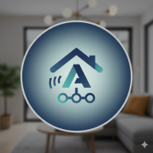

title: Home
---

# Google Home ↔ Home Assistant Personal Integration

This website documents a personal-use integration between Google Home (Google Assistant) and Home Assistant. It is intended solely for the developer's private, non-commercial use to connect their Home Assistant instance to Google Assistant.

- No user data is stored, shared, or sold to any third parties.
- All data transmitted is used solely for the purpose of controlling and querying the developer's smart home devices.

[Read the Privacy Policy](privacy-policy)
